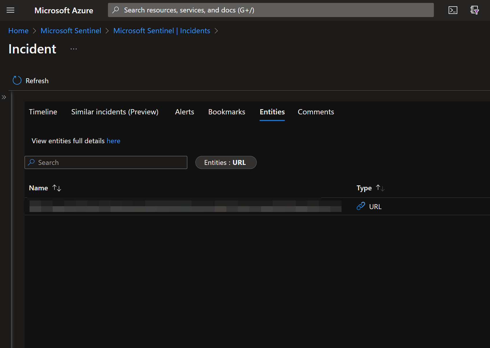
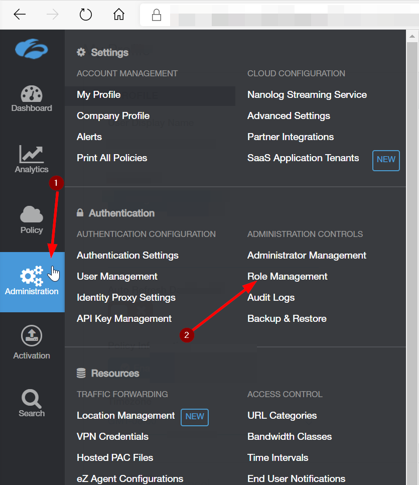
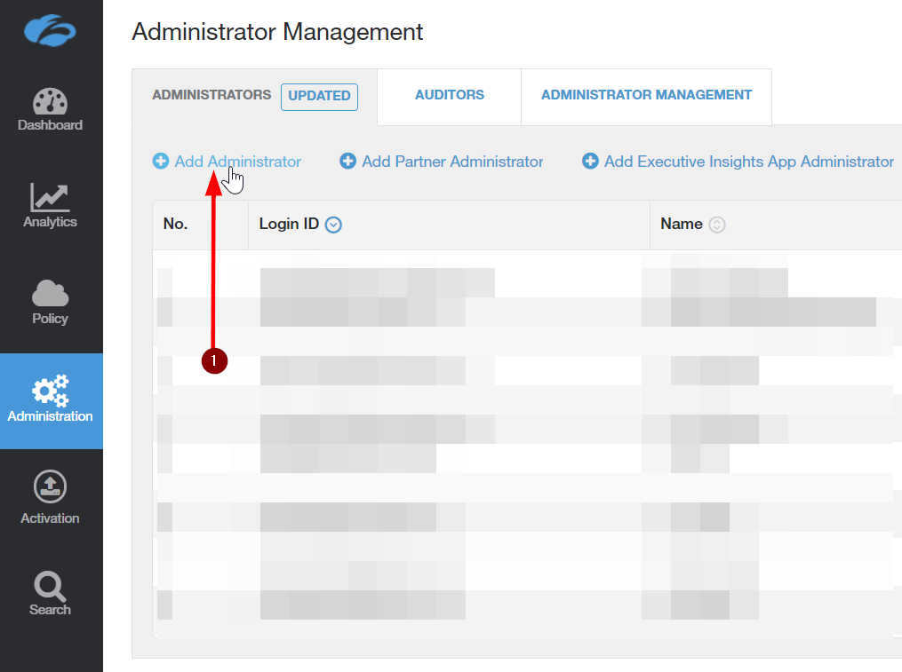
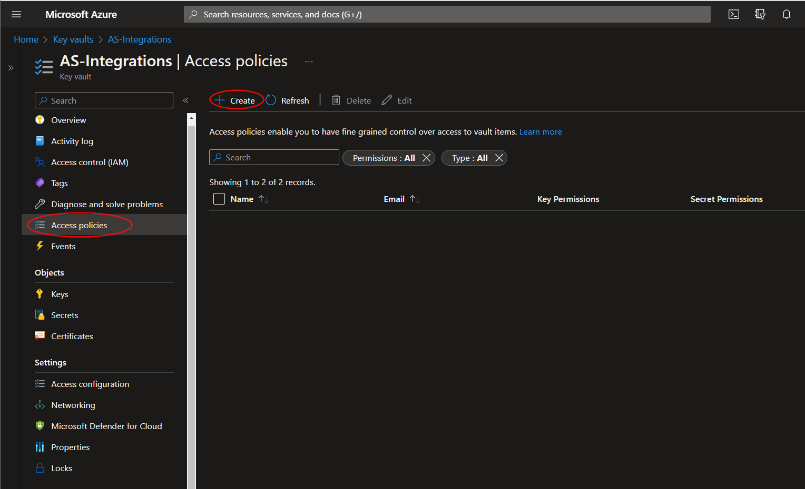

# AS-Zscaler-Integration

Author: Accelerynt

For any technical questions, please contact info@accelerynt.com  

    

This playbook is intended to be run from a Microsoft Sentinel incident. It will extract domains from Microsoft Sentinel incidents and add them to a Zscaler Custom URL Category of your choice.

#
### Requirements

The following items are required under the template settings during deployment: 

* The URL of your Zscaler organization
* A Zscaler local admin account configured for the API access neccess used in this playbook
* The username and password of the local administrator API account
* The API key of your Zscaler organization
* The name of the Zscaler Custom URL Category you wish to add the Microsoft Sentinel incident domains to

# 
### Setup

#### Zscaler Configuration:

Before deployment, you will need to configure you Zscaler API roles and API admin accounts.  

For this Playbook to modify your Zscaler custom domain list, you will need a local ZScaler admin account that has access to the read and modify policy. To limit the access this account has to only what is needed, you will need to make a custom administrator role. 

In the Zscaler administration console hover over **Administration then click on Role Management**.

Click on **Add Administrator Role**.

Create a **Name** for the **Administrator Role** and use the settings **exactly** as depicted in the image below. Then click the **Save** button.

Hover over the **Activation** button and click **Activate** to enable the new Role.

Next, hover over **Administration** and click on **Administrator Management**.

Click on **Add Administrator**.

Enter a **Login ID** for the API administrator account you want to create. 
In the **Email** box you can enter a preexisting service account, or simply make up an email address which you will not use in your domain. There is no need for email access for this account.
Enter a name for the account and in the drop-down box below, select the Role you created in the previous step.
Make sure **Password Based Login** is checked and create a secure password for this API account.
Take note of the email address and password, as it will be needed duing deployment.
Click **Save**, then hover over the **Activation** button and click **Activate**. This will enable the new administrator account.

To get your **API key** hover over the **Administration** button and click on **API Key Management**.

Here you will find you **API Key** as well as **Zscaler Instance Name.** You will need both of these when deploying this playbook. The typical instance names are Zscaler, ZscalerOne, ZscalerTwo, ZscalerThree, and ZsCloud.

Lastly, you will need to note the custom URL category you want the domains from Microsoft Sentinel incidents added to. Hover over the **Administration** button and click on **URL Categories.** Take note of the name of your desired URL category, as it will be needed duing deployment. In the example below we use name of our Custom category AS_Blocklist. This category in our test environment configured to a Zscaler access policy that disallows users access to any domain in in that list.

#### Create Azure Key Vault Secrets:

You will need to add you Zscaler API key and Zscaler password to an Azure key vault.

Navigate to the Azure key vaults page: https://portal.azure.com/#view/HubsExtension/BrowseResource/resourceType/Microsoft.KeyVault%2Fvaults

Select an existing key vault or create a new one. From the key vault overview page, click the "**Secrets**" menu option, found under the "**Settings**" section. Click "**Generate/Import**".

Choose a name for the secret, such as "**AS-Zscaler-Integration-API-Key**", and enter the Zscaler API key copied previously in the "**Value**" field. All other settings can be left as is. Click "**Create**". 

Repeat this process for your Zscaler API password. 

Once both secrets have been added to the vault, navigate to the "**Access policies**" menu option, also found under the "**Settings**" section on the key vault page menu. Leave this page open, as you will need to return to it once the playbook has been deployed. See [Granting Access to Azure Key Vault](https://github.com/Accelerynt-Security/AS-Zscaler-Integration#granting-access-to-azure-key-vault).

#
### Deployment                                                                                                         
                                                                                                        
To configure and deploy this playbook:

Open your browser and ensure you are logged into your Microsoft Sentinel workspace. In a separate tab, open the link to our playbook on the Arbala Security GitHub Repository:

https://github.com/Accelerynt-Security/AS-Zscaler-Integration

This deployment template contains two resources: An integration account and a logic app. The integration account is a requirement for executing javascript code, which is an operation used by the logicapp.

Click the “**Deploy to Azure**” button at the bottom and it will bring you to the custom deployment template.

In the **Project Details** section:

* Select the “**Subscription**” and “**Resource Group**” from the dropdown boxes you would like the playbook deployed to.  

In the **Instance Details** section:  
                                                  
* **Playbook Name**: This can be left as "**AS-Zscaler-Integration**" or you may change it. 

* **IntegrationAccountName**: Enter the name of a Microsoft integration account created in the same resource group this playbook will be deployed to.

* **ZscalerURL**: Enter your Zscaler tenant URL here.

* **Zscaler Username**:  Enter the username of the Zscaler Admin account. 

* **Zscaler Custom URL Category Name**: Enter a Zscaler Custom URL Category Name. 

 **Key Vault Name**:  Enter the name of the Key Vault that stores your Zscaler API key and Zscaler password. 

* **Zscaler API Key**: Enter the name of the Key Vault Secret that contains the value of your Zscaler API key. 

* **Zscaler Password**: Enter the name of the Key Vault Secret that contains the value of your Zscaler password. 

Towards the bottom, click on “**Review + create**”. 

Once the resources have validated, click on "**Create**".

The resources should take around a minute to deploy. Once the deployment is complete, you should see two resources. One is an Integration Account and the other is the Logic App.
Click the "**Go to resource group**" button.

Click the logic app resource.

Click on the “**Edit**” button. This will bring us into the Logic Apps Designer.

Click on the bar labled “**Connections**”.  

Here you can select an existing connection or create a new one.

Click the "**Save**" button.

#
### Granting Access to Azure Key Vault

Before the Logic App can run successfully, the key vault connection created during deployment must be granted access to the key vault storing your Zscaler API key and password.

From the key vault "**Access policies**" page, click "**Create**".

Select the "**Get**" checkbox under "**Secret permissions**", then click "**Next**".

Paste "**AS-Zscaler-Integration**" into the principal search box and click the option that appears. Click "**Next**" towards the bottom of the page.

Navigate to the "**Review + create**" section and click "**Create**".

#
### Running the Playbook

To run your new Logic App, navigate to the Microsoft Sentinel workspace you used during deployment.

Here you can select an incident that has an associated URL. Note that this Logic App will not work if no URL is associated with the incident (item 2). 

Click the "**View full details**" button.

Click the "**View playbooks**" link.

Click the "**Run**" button.

As you can see below - the domain/subdomains were parsed from the URL Entity in the Incident and added to the the Custom URL Category. 

